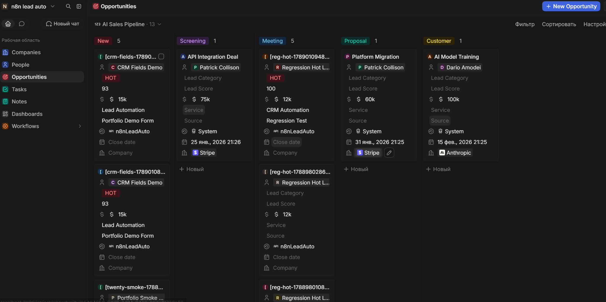
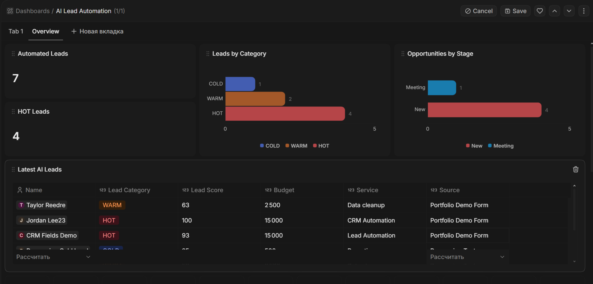

# AI Lead Automation — n8n + Twenty CRM

[](https://github.com/300nn/ai-lead-automation-n8n-twenty/actions/workflows/validate.yml)

A production-like lead intake and qualification pipeline built with **n8n**, **Twenty CRM**, **Mailpit**, and an optional **OpenAI** qualification branch.

The local demo runs with AI inference mocked by default, so it is deterministic and does **not require paid OpenAI API usage**. The real OpenAI branch is already wired and can be enabled by configuration when desired.

## What it does

A lead submits a demo form or webhook payload. The automation validates the request, creates an idempotency lock, qualifies the lead as HOT/WARM/COLD, upserts the person in Twenty CRM, creates an Opportunity for HOT leads, sends follow-up email, notifies sales, persists audit/state records, and handles Calendly bookings by moving the linked Opportunity forward in the pipeline.

```mermaid
flowchart LR
    A[Demo form / POST webhook] --> B[Validate + normalize]
    B --> C{Valid?}
    C -- No --> X[400 response]
    C -- Yes --> D[Idempotency lookup + lock]
    D --> E{Duplicate?}
    E -- Yes --> Y[already_completed / already_processing]
    E -- No --> F{AI mode}
    F -- Mock --> G[Deterministic qualification]
    F -- OpenAI --> H[Structured AI qualification]
    H --> I[Parser + deterministic fallback]
    G --> J[Qualification context]
    I --> J
    J --> K[Twenty Person upsert]
    K --> L{HOT?}
    L -- Yes --> M[Twenty Opportunity upsert]
    L -- No --> N[No deal]
    M --> O[Follow-up email]
    N --> O
    O --> P[Sales notification for HOT]
    P --> Q[Persist completed + audit]
    Q --> R[Webhook response]
    S[Calendly webhook] --> T[Lookup lead by email]
    T --> U[Update Opportunity stage in Twenty]
```



## Demo screenshots

### AI Leads


### AI Sales Pipeline



### Dashboard



## Verified behavior

The regression suite passed **11/11 scenarios** in the local Twenty/Mailpit environment:

| Test | Result |
|---|---|
| Production webhook registration | PASS |
| Invalid payload validation | PASS |
| HOT lead | PASS |
| WARM lead | PASS |
| COLD lead | PASS |
| Idempotency | PASS |
| Twenty Person upsert | PASS |
| Calendly HOT → stage update | PASS |
| Calendly WARM → no-deal safe path | PASS |
| Calendly irrelevant event ignored | PASS |
| Mailpit delivery | PASS |

See [`tests/REGRESSION_RESULTS.md`](tests/REGRESSION_RESULTS.md) for the captured result and [`tests/run-all-tests.ps1`](tests/run-all-tests.ps1) for the executable regression suite.

Repository-level CI also validates JSON syntax, manifest consistency, the recorded 11/11 regression summary, and basic public-secret hygiene on every push and pull request. See [`scripts/validate_repo.py`](scripts/validate_repo.py) and [`.github/workflows/validate.yml`](.github/workflows/validate.yml).

## Reliability features

- Request validation before external integrations.
- Deterministic request IDs and idempotency state table.
- Processing lock to prevent concurrent duplicate work.
- Person upsert instead of duplicate contact creation.
- Opportunity creation only for HOT leads.
- Retry policies on CRM, SMTP, and OpenAI HTTP calls.
- Deterministic AI fallback if the real AI branch fails or returns unusable output.
- Separate audit table for lifecycle events.
- Global error workflow.
- Safe Calendly handling when a lead has no Opportunity.
- Independent feature switches for AI, CRM, email, and notifications.

More detail: [`docs/ARCHITECTURE.md`](docs/ARCHITECTURE.md) and [`docs/DESIGN_DECISIONS.md`](docs/DESIGN_DECISIONS.md).

## Workflows

| File | Purpose |
|---|---|
| `00_setup_data_tables.json` | Creates local state and audit Data Tables |
| `01_twenty_connectivity_check.json` | Verifies Twenty People/Opportunity API connectivity |
| `02_ai_lead_qualification.json` | Main lead qualification and CRM automation workflow |
| `03_calendly_booking_handler.json` | Handles `invitee.created` and updates Opportunity stage |
| `04_global_error_handler.json` | Global workflow error capture |
| `05_portfolio_demo_form.json` | Serves the local HTML demo form from an n8n webhook |

All public workflow exports are sanitized: they contain **credential placeholders, not secrets**.

## Local stack used for validation

- n8n `2.33.5`
- Twenty CRM `v2.37.5`
- PostgreSQL 16 (Twenty database)
- Redis (Twenty)
- Mailpit `v1.31.1`
- Docker Desktop on Windows

The n8n host port may be dynamic. Helper scripts resolve it with `docker port lead-automatisation 5678/tcp` instead of hardcoding `327xx`.

## Quick start on an existing local stack

1. Import the workflows from `workflows/` into n8n. Run workflow `00` once to create Data Tables.
2. Create/rebind these n8n credentials:
   - `Twenty | n8n Lead Automation` — HTTP Bearer Auth using a Twenty API key.
   - `Mailpit | n8n Lead Automation` — SMTP to `mailpit:1025`.
   - `OpenAI | n8n Lead Automation` — optional; only required when `mockAI=false`.
3. Keep the Twenty internal URL as `http://twenty:3000` when n8n and Twenty share a Docker network.
4. Publish workflows `02`, `03`, `04`, and `05` from the n8n UI.
5. Configure workflow `04` as the error workflow for the production workflows if your imported IDs changed.
6. Open the demo with `scripts/OPEN_DEMO.cmd` or navigate to `/webhook/portfolio/demo` on the current n8n host port.
7. Run `tests/RUN_TESTS.cmd` to execute the regression suite.

For Twenty fields and CRM views, see [`docs/TWENTY_SCHEMA.md`](docs/TWENTY_SCHEMA.md).

## AI modes

Local portfolio mode uses:

```text
mockAI=true
mockCRM=false
mockEmail=false
mockNotification=false
```

This means Twenty and Mailpit are exercised for real while AI inference is deterministic. To test real inference, configure the OpenAI credential and set `mockAI=false` in **Normalize + Config**. The parser still falls back deterministically if the AI response cannot be used.

## Demo

A clean demonstration takes 3–5 minutes:

1. Open the local form.
2. Submit a HOT preset.
3. Show the returned qualification and IDs.
4. Open Twenty → AI Leads and show the new Person.
5. Open AI Sales Pipeline and show the Opportunity.
6. Open Mailpit and show the generated email.
7. Send the same request ID again and show `already_completed`.
8. Trigger the Calendly sample and show the Opportunity stage update.
9. Open the dashboard and finish with the 11/11 regression result.

A prepared script is in [`docs/DEMO_SCRIPT.md`](docs/DEMO_SCRIPT.md).

## Security / production hardening

This repository is a **local portfolio implementation**, not an internet-exposed production deployment. Before public exposure, add webhook authentication/signature verification, rate limiting, HTTPS, secret rotation, stricter network boundaries, production email delivery, monitoring/alerting, and a persistent n8n data volume.

No API keys, SMTP passwords, bearer tokens, or decrypted n8n credentials are committed to this repository.

## Repository structure

```text
.
├── workflows/
├── samples/
├── tests/
├── docs/
│   └── screenshots/
├── scripts/
├── web/
├── .env.example
├── README.md
└── README_RU.md
```

## What this project demonstrates

Backend-oriented automation design rather than only visual node wiring: API integration, structured data contracts, idempotency, state transitions, retries, graceful degradation, CRM data modeling, test automation, observability, and end-to-end debugging across Dockerized services.
